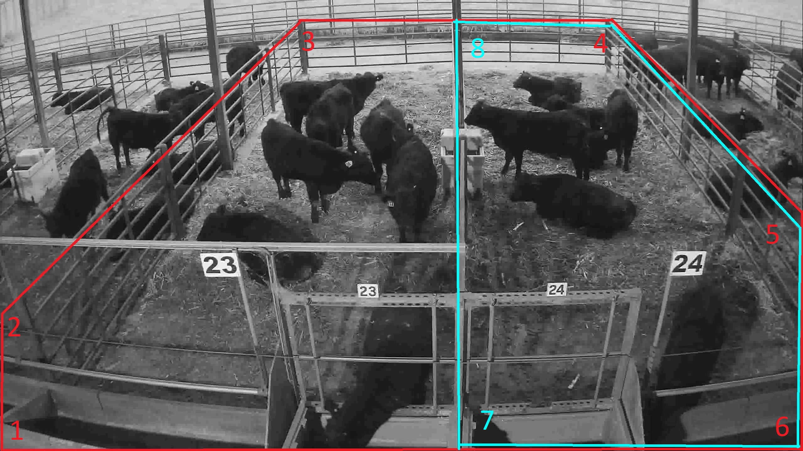
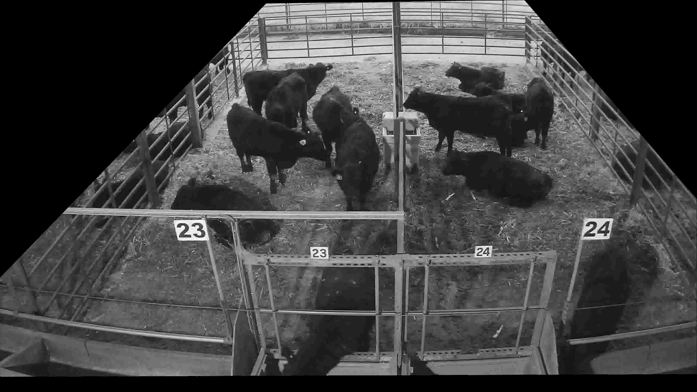

# Yolov5 for object counting in ROI


<div align="center">
<br>
<div>
<a href="https://github.com/mikel-brostrom/Yolov5_DeepSort_Pytorch/actions"></a>
<br>  
<a href="https://colab.research.google.com/drive/1K2xtRcZvlDClPYhjIt7Z5_5FLhrGOKxE?authuser=2#scrollTo=Q-4tlUaCBjDC"></a>
 
</div>

</div>

TODO
# ROI -- будет инициализироваться на каждом кадре, что бессмысленно!! Вытащить размер изображения по-другому!!!

## Introduction

The detections generated by [YOLOv5](https://github.com/ultralytics/yolov5), a family of object detection architectures and models pretrained on the COCO dataset.


## Before you run the tracker

1. Clone the repository recursively:

`git clone --recurse-submodules https://github.com/Onlyorlov/load_counter.git`

If you already cloned and forgot to use `--recurse-submodules` you can run `git submodule update --init`

2. Make sure that you fulfill all the requirements: Python 3.8 or later with all [requirements.txt](https://github.com/Onlyorlov/load_counter/blob/master/requirements.txt) dependencies installed, including torch>=1.7. To install, run:

`pip install -r requirements.txt`


## Tracking sources

Tracking can be run on most video formats

```bash
$ python track.py --source 0  # webcam
                           img.jpg  # image
                           vid.mp4  # video
                           path/  # directory
                           path/*.jpg  # glob
                           'https://youtu.be/Zgi9g1ksQHc'  # YouTube
                           'rtsp://example.com/media.mp4'  # RTSP, RTMP, HTTP stream
```

## ROI mask for counting people

For counting objects in region of interest(ROI) you can submit list of coordinates of each corner of the ROI.
Coordinates in pixels in original image shape.
Default threshold - 70%(0.7 of bbox area should be inside of ROI).

<div align="center">
<p>
  
</p>
</div>

```bash
$ python track.py --source 0  --mask '[[[484,412], [754,377], [1333,433], [1404,1017], [1404,1076], [122,1076],[419,804]]]'
```


## Select object detection model

### Yolov5

There is a clear trade-off between model inference speed and accuracy. In order to make it possible to fulfill your inference speed/accuracy needs
you can select a Yolov5 family model for automatic download

```bash


$ python track.py --source 0 --yolo_model yolov5n.pt --img 640
                                            yolov5s.pt
                                            yolov5m.pt
                                            yolov5l.pt 
                                            yolov5x.pt --img 1280
                                            ...
```

## Filter tracked classes

By default the tracker tracks all MS COCO classes.

If you only want to track persons I recommend you to get [these weights](https://drive.google.com/file/d/1gglIwqxaH2iTvy6lZlXuAcMpd_U0GCUb/view?usp=sharing) for increased performance

```bash
python3 track.py --source 0 --yolo_model yolov5/weights/crowdhuman_yolov5m.pt --classes 0  # tracks persons, only
```

If you want to track a subset of the MS COCO classes, add their corresponding index after the classes flag

```bash
python3 track.py --source 0 --yolo_model yolov5s.pt --classes 16 17  # tracks cats and dogs, only
```

[Here](https://tech.amikelive.com/node-718/what-object-categories-labels-are-in-coco-dataset/) is a list of all the possible objects that a Yolov5 model trained on MS COCO can detect. Notice that the indexing for the classes in this repo starts at zero.